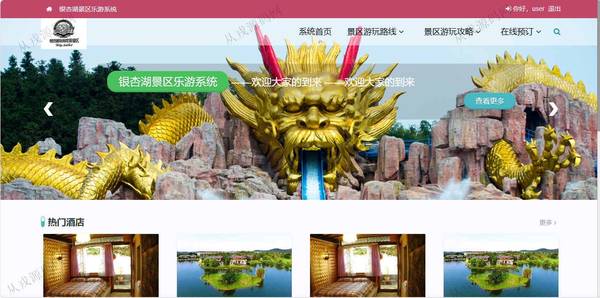
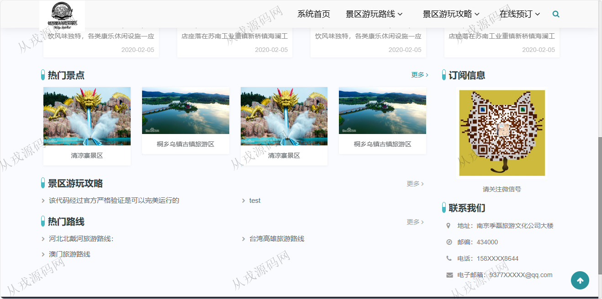
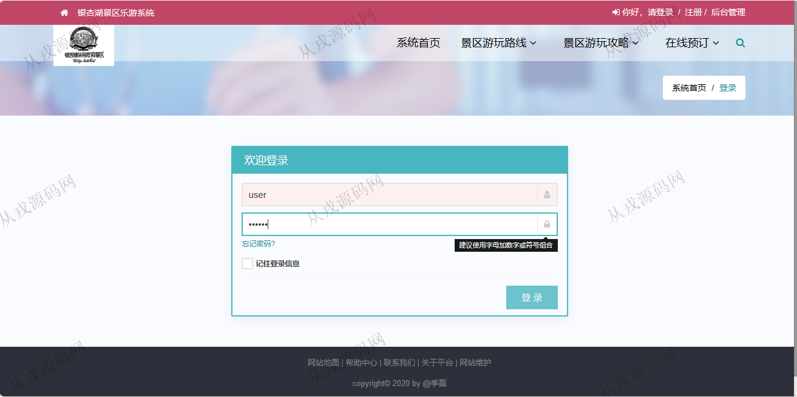
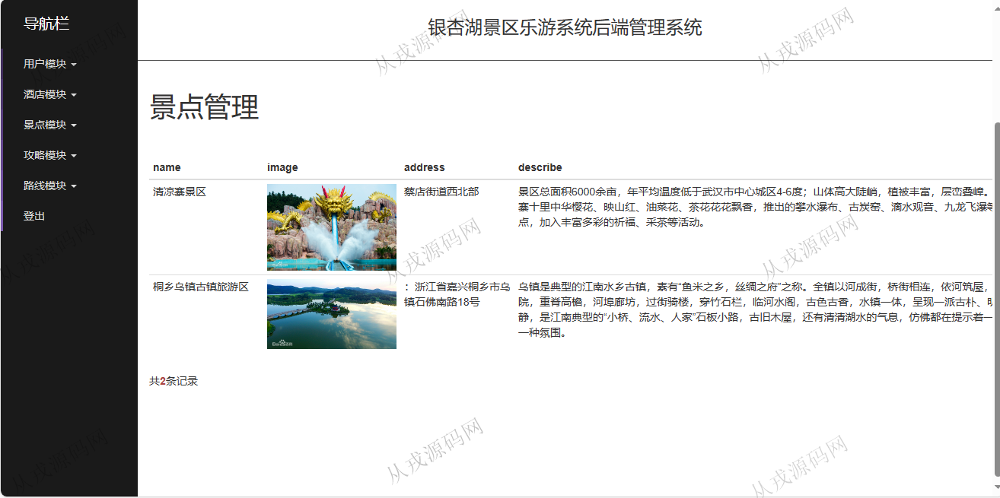

<h1 align="center">187.旅游景区游玩管理系统</h1>

- <b>完整代码获取地址：从戎源码网 ([https://armycodes.com/](https://armycodes.com/))</b>
- <b>技术探讨、资料分享，请加QQ群：692619798</b> 
- <b>作者微信：19941326836  QQ：952045282</b> 
- <b>承接计算机毕业设计、Java毕业设计、Python毕业设计、深度学习、机器学习</b>
- <b>选题+开题报告+任务书+程序定制+安装调试+论文+答辩ppt 一条龙服务</b>
- <b>所有选题地址 ([https://github.com/YuLin-Coder/AllProjectCatalog](https://github.com/YuLin-Coder/AllProjectCatalog)) </b>

## 项目介绍
基于springboot的旅游景区游玩管理系统：前端 html、jquery、bootstrap，后端 maven、springmvc、spring、jpa；角色分为管理员、用户；集成景区游玩路线、游玩攻略、在线预订等功能于一体的系统。

## 功能介绍

### 用户

- 基本功能：登录，注册，退出，个人信息查看与修改，密码修改
- 网站首页：主导航栏，广告图，热门酒店，热门景点
- 景区游玩路线：路线列表，按名称模糊搜索，路线详情，关注，取消关注，我的关注路线
- 景区游玩攻略：攻略列表，按名称模糊搜索，攻略详情，发布攻略，收藏攻略
- 在线预订：预订酒店，预订景点，我的预定列表，取消预定

### 管理员

- 用户管理：用户由前台自行注册而来，管理员可以在后台查询，重置密码
- 酒店管理：酒店信息的增删改查，启用，禁用
- 景点管理：景点信息的增删改查，启用，禁用
- 审核攻略：用户在前台发布的攻略信息，管理员后台查看，并进行审核，审核通过了，其他用户才可以看到
- 路线管理：路线信息的增删改查，启用，禁用

## 环境

- <b>IntelliJ IDEA 2021.3</b>

- <b>Mysql 5.7.26</b>

- <b>JDK 1.8</b>

## 运行截图

